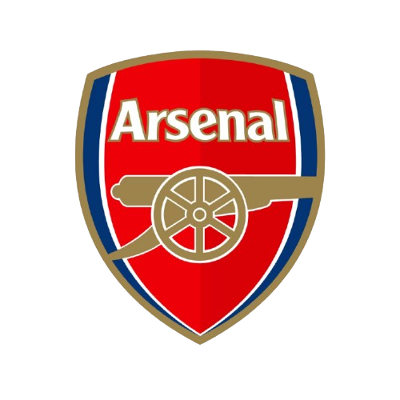

# ⚽ UnofficialFC

<div align="center">


*(Arsenal FC vs FC Barcelona — Paris 2006)*

[](LICENSE)
[](https://developer.mozilla.org/en-US/docs/Web/HTML)
[](https://developer.mozilla.org/en-US/docs/Web/CSS)
[](https://developer.mozilla.org/en-US/docs/Web/JavaScript)
[](https://greensock.com/gsap/)
[](https://threejs.org/)
[](https://tailwindcss.com/)

**A next-generation digital football platform & interactive tactical museum.**

[Explore Homepage](#-key-features) • [Enter 2006 UCL Museum](#-2006-ucl-final-digital-museum) • [Tech Stack](#-technology-stack) • [Quick Start](#-quick-start)

---

</div>

## 🌟 Overview

**UnofficialFC** is an immersive, high-performance web experience designed for football nerds, tacticians, and casual fans alike. Built around cutting-edge frontend animation engines and 3D WebGL graphics, UnofficialFC transforms football analysis from static diagrams into living, fluid interactive visualizers.

The platform comprises two core experiences:
1. **UnofficialFC Hub (`index.html`)**: A futuristic launchpad equipped with a live 2D tactical switch engine (High Press vs. Low Block), 3D WebGL matrix background with interactive cursor particle trails, interactive 3D tilt cards, real-time countdown, and animated tactical feedback submission.
2. **2006 UCL Final Digital Museum (`ucl1.html`)**: An interactive scrollytelling museum chronicling the legendary 2006 UEFA Champions League Final between **FC Barcelona** and **Arsenal FC** (*The Parisian Deluge*). Features real-time Canvas animation loops for goal plays, interactive heatmaps, word-by-word scrollytelling essay engines, and dynamic atmospheric rain effects.

---

## 🚀 Key Features

### 1. ⚡ UnofficialFC Platform Hub (`index.html`)
- **Interactive Tactical Engine Switcher**: Switch dynamically between **Execute High Press** and **Drop Low Block** formations on a custom 2D HTML5 Canvas (`#tactical-bg`).
- **3D WebGL Matrix Engine**: Powered by **Three.js**, rendering floating wireframe geometries (Dodecahedron, Icosahedron, Torus Knot), glowing node networks, and responsive GSAP cursor parallax trails (`#homepage-matrix-canvas`).
- **GSAP Fluid Cursor & Magnetic Physics**: Smooth Custom Cursor with hover expansion physics and magnetic attraction on navigational nodes and interactive buttons.
- **3D Tilt Cards**: Interactive glassmorphic cards with dynamic neon glow and 3D perspective rotation on hover.
- **Real-Time Launch Countdown**: Live countdown timer targeting the platform's official compiled release.
- **Interactive Tactical Contact Form**: Web3Forms-integrated feedback form that executes an animated 2D Tiki-Taka tactical sequence on pitch submit before transmitting intel.

---

### 2. 🏛️ 2006 UCL Final Digital Museum (`ucl1.html`)
> *"Paris. Stade de France. May 17, 2006."*

An immersive scrollytelling retrospective exploring the tactical clash between Frank Rijkaard's FC Barcelona and Arsène Wenger's Arsenal FC.

- **Hero Split Screen & Collapsible Sticky Nav**: Interactive split-screen featuring team badges (`ars.png` & `fcb.png`) with rain overlays that seamlessly shrinks into a sleek, frosted glass sticky navigation bar upon scrolling.
- **Word-by-Word Scrollytelling Engine**: GSAP ScrollTrigger-driven essay presentation that illuminates words dynamically as you scroll through key tactical commentary.
- **The 20-Second Goal Simulation Holodeck**:
  - **Moment 1 (18')**: Jens Lehmann's catastrophic red card & Giuly's disallowed finish.
  - **Moment 2 (76')**: Iniesta → Larsson → Samuel Eto'o's equalizer.
  - **Moment 3 (81')**: Belletti's iconic game-winning goal through Manuel Almunia's legs.
- **Interactive Tactical Pitch (`#tactical-pitch`)**: 22 positionally tracked player nodes and animated ball flight paths with frame controls and toggleable moment tabs.
- **Henrik Larsson Tactical Autopsy & Heatmap**: Custom Canvas heatmap (`#heatmap-canvas`) visualizing Larsson's half-space operational density during his game-changing 29-minute cameo.
- **Atmospheric Rain & Glass Droplet Overlay**: Multi-layered Canvas rain particle system paired with sliding glass water droplets for full atmospheric immersion in the Parisian deluge.

---

## 🛠️ Technology Stack

| Technology | Purpose & Usage |
| :--- | :--- |
| **HTML5** | Semantic structure for both core platform pages and canvas elements |
| **CSS3 & Tailwind CSS** | Custom glassmorphism, CSS variables, neon glows, responsive grid/flexbox layouts |
| **JavaScript (ES6+)** | State machines, custom animation tickers, event listeners, form processing |
| **GSAP (3.12.5)** | ScrollTrigger, ScrollToPlugin, `quickTo` cursor physics, smooth element timelines |
| **Three.js (r128)** | 3D WebGL scene rendering, camera perspective, wireframes, particle systems |
| **HTML5 Canvas API** | Custom 2D tactical pitch node renderer, rain systems, and thermal heatmaps |
| **Web3Forms API** | Asynchronous form submission endpoint for tactical feedback transmission |

---

## 📁 Repository Structure

```
├── index.html          # UnofficialFC main landing page & tactical engine panel
├── script.js           # GSAP animation engine, 3D WebGL matrix scene, tactical switch logic
├── style.css           # Global theme variables, glassmorphic UI, responsive layouts
├── ucl1.html           # 2006 UCL Final Digital Museum scrollytelling experience
├── ucl1.js             # UCL Museum state machine, 22-node pitch simulator, rain & heatmap engines
├── ucl1.css            # Custom museum typography (Syne & Plus Jakarta Sans), neon glows, droplet FX
├── ars.png             # Official Arsenal FC crest asset
├── fcb.png             # Official FC Barcelona crest asset
└── README.md           # Project documentation
```

---

## 💻 Quick Start & Local Setup

Since UnofficialFC is built using modern static web technologies with CDN-delivered libraries, **no compilation or heavy npm installation is required**.

### Option 1: Live Local Server (Recommended)
1. Clone the repository:
   ```bash
   git clone https://github.com/subhayanpathak/UnofficialFC.git
   cd UnofficialFC
   ```
2. Launch with a local static server (e.g. VS Code Live Server, Python HTTP server, or `npx serve`):
   ```bash
   # Python 3
   python3 -m http.server 8000

   # Or Node npx
   npx serve .
   ```
3. Open `http://localhost:8000` in any modern WebGL-compatible web browser.

### Option 2: Direct File Opening
- Simply double-click `index.html` or `ucl1.html` to open directly in Chrome, Firefox, Safari, or Edge.

---

## 📱 Mobile & Responsive Support

UnofficialFC is fully optimized across all viewport sizes (Desktop, Tablet, Mobile):
- **Desktop**: Full WebGL 3D parallax background, interactive mouse cursor expansion, hardware-accelerated 60fps canvas visualizers.
- **Mobile**: Touch-optimized touch targets, automatic cursor suppression, responsive navbar stacked layouts, lightweight particle counts for optimized battery & GPU performance.

---

## 👤 Author & Credits

**Engineered & Designed with 💙❤️ by Subhayan Pathak**
- *Founder & Editor-in-Chief, UnofficialFC*
- *Vision*: Merging high-IQ football tactical analysis, data geometry, and high-performance digital art.

---

<div align="center">

*© UnofficialFC. Built to change exactly how you perceive the geometry of the pitch.*

</div>
